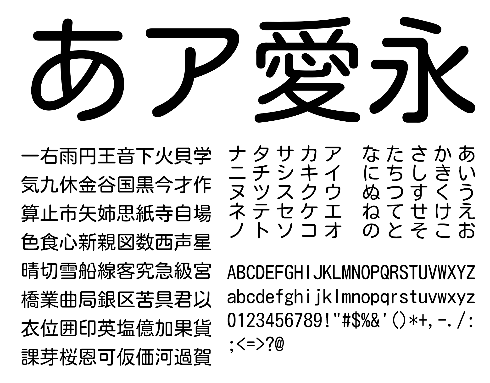

# Kosugi Maru

[![][Fontbakery]](https://googlefonts.github.io/kosugi-maru/fontbakery-report.html)
[![][Universal]](https://googlefonts.github.io/kosugi-maru/fontbakery-report.html)
[![][GF Profile]](https://googlefonts.github.io/kosugi-maru/fontbakery-report.html)
[![][Outline Correctness]](https://googlefonts.github.io/kosugi-maru/fontbakery-report.html)
[![][Shaping]](https://googlefonts.github.io/kosugi-maru/fontbakery-report.html)

[Fontbakery]: https://img.shields.io/endpoint?url=https%3A%2F%2Fraw.githubusercontent.com%2Fgooglefonts%2Fkosugi-maru%2Fgh-pages%2Fbadges%2Foverall.json
[GF Profile]: https://img.shields.io/endpoint?url=https%3A%2F%2Fraw.githubusercontent.com%2Fgooglefonts%2Fkosugi-maru%2Fgh-pages%2Fbadges%2FGoogleFonts.json
[Outline Correctness]: https://img.shields.io/endpoint?url=https%3A%2F%2Fraw.githubusercontent.com%2Fgooglefonts%2Fkosugi-maru%2Fgh-pages%2Fbadges%2FOutlineCorrectnessChecks.json
[Shaping]: https://img.shields.io/endpoint?url=https%3A%2F%2Fraw.githubusercontent.com%2Fgooglefonts%2Fkosugi-maru%2Fgh-pages%2Fbadges%2FShapingChecks.json
[Universal]: https://img.shields.io/endpoint?url=https%3A%2F%2Fraw.githubusercontent.com%2Fgooglefonts%2Fkosugi-maru%2Fgh-pages%2Fbadges%2FUniversal.json

Kosugi Maru is a Gothic Rounded design, with low stroke contrast and monospaced metrics, and rounded terminals. Initially developed by MOTOYA and released for the Android platform under the Apache license, the typeface is based on a design from the 1950s. It aims for beauty and readability, and evokes the Japanese cedar trees that have straight and thick trunks and branches. Originally available as "MotoyaLMaru W3 mono", it is now available under the name Kosugi Maru. A regular gothic version is available as [Kosugi](https://github.com/googlefonts/kosugi).

## About

The development of Motoya typefaces began in the 1950s and continues to the present day. During this time, Motoya typeface has changed its product form by supporting various typesetting methods such as lead typeface, typesetting typeface, typesetting dial, and digital font (bitmap font / outline font). However, in the long history of typeface development, the pursuit of "readability" and "beauty of characters" remains unchanged. 

## Building

Fonts are built automatically by GitHub Actions - take a look in the "Actions" tab for the latest build.

If you want to build fonts manually on your own computer:

* `make build` will produce font files.
* `make test` will run [FontBakery](https://github.com/googlefonts/fontbakery)'s quality assurance tests.
* `make proof` will generate HTML proof files.

The proof files and QA tests are also available automatically via GitHub Actions - look at `https://googlefonts.github.io/kosugi-maru`.

## Changelog

**25 Aug 2021. Version 4.001**
- First check-in

## License

This Font Software is licensed under the Apache License, Version 2.0.
This license is available at http://www.apache.org/licenses/

## Repository Layout

This font repository structure is inspired by [Unified Font Repository v0.3](https://github.com/unified-font-repository/Unified-Font-Repository), modified for the Google Fonts workflow.
